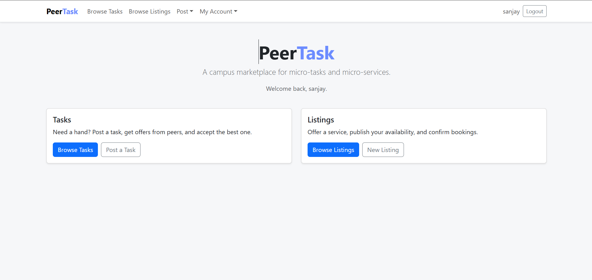

# PeerTask — Campus Micro-Task & Service Marketplace

A full-stack web application where university students can post micro-tasks they need help with, offer micro-services to peers, and manage bookings — all within a same-campus community.

---

## Project Objective

PeerTask gives university students a trusted, campus-scoped marketplace to exchange help and services. It serves as:

- A **Task Board** where students post tasks (moving furniture, tutoring, proofreading) and receive offers from peers willing to help.
- A **Service Listings** platform where students publish their skills (guitar lessons, photography, bike repair) with availability slots and accept booking requests.
- A **Personal Dashboard** where each user manages their posted tasks, submitted offers, owned listings, and booking history.

---

## Screenshot



---

## Tech Stack

| Layer | Technology |
|---|---|
| Runtime | Node.js v18+ |
| Backend | Express 4 (REST API, session auth, static serving) |
| Database | MongoDB 6 (Atlas) — native driver, no Mongoose |
| Auth | Passport.js (passport-local) + express-session + bcrypt |
| Frontend | React 18 + Vite (client-side rendering, SPA) |
| UI | React-Bootstrap 2 + Bootstrap 5 (light theme) |
| Routing | React Router DOM 6 |
| Linting | ESLint + Prettier |

---

## Project Structure

```
PeerTask/
├── server/
│   ├── config/
│   │   ├── db.js              # MongoDB native driver connection + collection accessors
│   │   ├── passport.js        # passport-local strategy (bcrypt verify)
│   │   └── session.js         # express-session configuration
│   ├── controllers/
│   │   ├── authController.js  # register, login, logout, session
│   │   ├── taskController.js  # browseTasks (aggregation), createTask, getTask, updateTask, deleteTask, myTasks
│   │   ├── offerController.js # submitOffer, respondToOffer (atomic), withdrawOffer, myOffers
│   │   ├── listingController.js # browseListings (aggregation), createListing, getListing, updateListing, deleteListing, myListings
│   │   └── bookingController.js # requestBooking, respondToBooking (atomic), myBookings
│   ├── middleware/
│   │   ├── authGuard.js       # 401 guard for protected routes
│   │   ├── errorHandler.js    # Central 4-arg Express error handler
│   │   └── validation.js      # ApiError class + input validation helpers
│   ├── routes/
│   │   ├── authRoutes.js
│   │   ├── taskRoutes.js      # + offersRouter (GET /api/offers/mine)
│   │   └── listingRoutes.js   # + bookingsRouter (GET /api/bookings/mine)
│   ├── utils/
│   │   └── ids.js             # toObjectId helper
│   ├── server.js              # App entry point
│   ├── seed.js                # Small deterministic seed (concurrency demos)
│   ├── seed_1000.js           # 1k+ synthetic records seed
│   ├── .env.example           # Environment variable template
│   └── package.json
├── client/
│   ├── src/
│   │   ├── components/
│   │   │   ├── Nav/           # App navbar (dropdowns when logged in)
│   │   │   ├── Layout.jsx     # Container shell
│   │   │   ├── ProtectedRoute.jsx
│   │   │   ├── ErrorMessage.jsx
│   │   │   └── Pagination.jsx
│   │   ├── pages/
│   │   │   ├── Home/          # Landing page
│   │   │   ├── BrowseTasks/   # Task board with filters + pagination
│   │   │   ├── BrowseListings/ # Listings board with filters + pagination
│   │   │   ├── TaskDetail/    # Task + offers, accept/decline (atomic)
│   │   │   ├── ListingDetail/ # Listing + bookings, confirm/cancel (atomic)
│   │   │   ├── CreateTask/
│   │   │   ├── CreateListing/
│   │   │   ├── MyTasks/
│   │   │   ├── MyOffers/
│   │   │   ├── MyListings/
│   │   │   ├── MyBookings/
│   │   │   ├── Login/
│   │   │   └── Register/
│   │   ├── hooks/
│   │   │   └── useAuth.jsx    # Auth context + provider
│   │   ├── services/
│   │   │   ├── api.js         # Fetch wrapper
│   │   │   └── fmt.js         # Date, range, statusVariant helpers
│   │   └── styles/
│   │       └── styles.css     # Global body background
│   ├── vite.config.js         # Dev proxy /api → localhost:3000
│   └── package.json
├── .gitignore
├── LICENSE
└── README.md
```

---

## How to Install and Run

### Prerequisites

- Node.js v18+
- A MongoDB instance — [MongoDB Atlas](https://www.mongodb.com/atlas) free tier or local

### 1. Clone the repository

```bash
git clone https://github.com/anurag-reddy1/PeerTask.git
cd PeerTask
```

### 2. Configure the server environment

```bash
cp server/.env.example server/.env
```

Edit `server/.env`:

```env
PORT=3000
MONGODB_URI=mongodb+srv://<user>:<password>@cluster.mongodb.net/
DB_NAME=peertask
SESSION_SECRET=change-me-to-a-long-random-string
```

### 3. Seed the database

```bash
cd server
node --env-file-if-exists=.env seed_1000.js
```

All generated users share the password **`password123`**.

### 4. Run in development

Open two terminals:

```bash
# Terminal 1 — API server
cd server
npm install
npm run dev

# Terminal 2 — Vite dev server
cd client
npm install
npm run dev
```

Open [http://localhost:5173](http://localhost:5173).

### 5. Run in production

```bash
cd client && npm install && npm run build
cd ../server && npm install && npm start
```

Open [http://localhost:3000](http://localhost:3000).

---

## Features

### Task Board

- Browse open tasks with filters: budget range, location, available-after date
- Server-side aggregation pipeline: pending offer count joined per task, poster name/school joined from Users
- Post, edit, and delete your own tasks
- Submit an offer on any open task you didn't post
- **Atomic offer acceptance**: accepting an offer flips the task to `matched` via a single `findOneAndUpdate({ status: "open" })` — a concurrent accept gets a 409

### Service Listings

- Browse available listings with filters: category, max rate, available-after date
- Server-side aggregation pipeline: pending booking count joined per listing, provider name/school joined from Users
- Create listings with multiple availability slots
- Request a booking for any slot within a listing's availability window
- **Atomic booking confirmation**: confirming a booking claims the slot via `findOneAndUpdate` with a `$not/$elemMatch` overlap guard — a concurrent confirm for the same slot gets a 409

### Personal Dashboard

- **My Tasks** — tasks you posted, all statuses
- **My Offers** — offers you submitted, with linked task info
- **My Listings** — listings you own
- **My Bookings** — bookings you requested, with linked listing info

### Authentication

- Register with name, email, password, school, and bio
- Session-based login via Passport.js (passport-local)
- Passwords hashed with bcrypt (10 salt rounds)
- `passwordHash` never returned to the client — projected away at every layer

---

## Deployment (Render)

Deploy as a **single Web Service** (Express serves the built React client):

| Setting | Value |
|---|---|
| Root Directory | _(empty — repo root)_ |
| Build Command | `npm install --prefix client --include=dev && npm run build --prefix client && npm install --prefix server` |
| Start Command | `cd server && npm start` |

Set environment variables in the Render dashboard:
```
MONGODB_URI=...
DB_NAME=peertask
SESSION_SECRET=...
NODE_ENV=production
```

---

## GenAI Usage

Tool: Claude Sonnet 4.6 (Anthropic)

Usage Highlights:

Code Review & Security Audits: Utilized the model to audit core backend controllers, resulting in the implementation of robust atomic concurrency patterns using MongoDB findOneAndUpdate race guards to securely prevent double-booking anomalies.

Refactoring & UI Standardization: Consulted the model on the most efficient path to migrate a legacy custom dark-theme CSS codebase into a standardized, responsive React-Bootstrap light-theme system across components and views.

Tooling & Linter Optimization: Leveraged suggestions to configure clean, isolated flat ESLint configurations (v9 for client, v10 for server) integrated with Prettier to enforce strict production-ready code quality standards.

Performance Testing Strategy: Used the tool to review a mock-data script strategy, adopting suggestions for a deterministic pseudo-random generator function inside seed_1000.js to scale testing up to 3,000+ relational records.

---

## Authors

**Anurag Reddy Pottigari**

- **Email**: [pottigari.a@northeastern.edu](mailto:pottigari.a@northeastern.edu)
- **LinkedIn**: [linkedin.com/in/anurag-reddy-pottigari](https://www.linkedin.com/in/anurag-reddy-7140a85a)
- **GitHub**: [github.com/anurag-reddy1](https://github.com/anurag-reddy1)

**Sanjay Balakrishnan Venkat**

- **Email**: [balakrishnanvenkat.s@northeastern.edu](mailto:balakrishnanvenkat.s@northeastern.edu)
- **LinkedIn**: [linkedin.com/in/sanjaysundarbv](https://www.linkedin.com/in/sanjaysundarbv/?skipRedirect=true)
- **GitHub**: [github.com/sasu3303](https://github.com/sasu3303)

---

## Class Link

**CS 5610 - Web Development**
Northeastern University — Khoury College of Computer Sciences
🔗 [Course Link](https://johnguerra.co/classes/webDevelopment_online_summer_2026/)

---

## Video Demonstration

🎥 _Link to be added before submission._

---

## Live Project Link

https://peertask-84vp.onrender.com/

---

## License

This project is licensed under the **MIT License** — see the [LICENSE](LICENSE) file for details.
